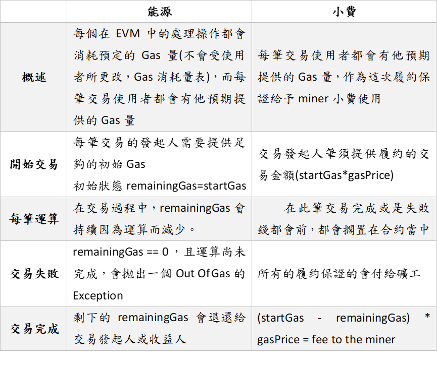
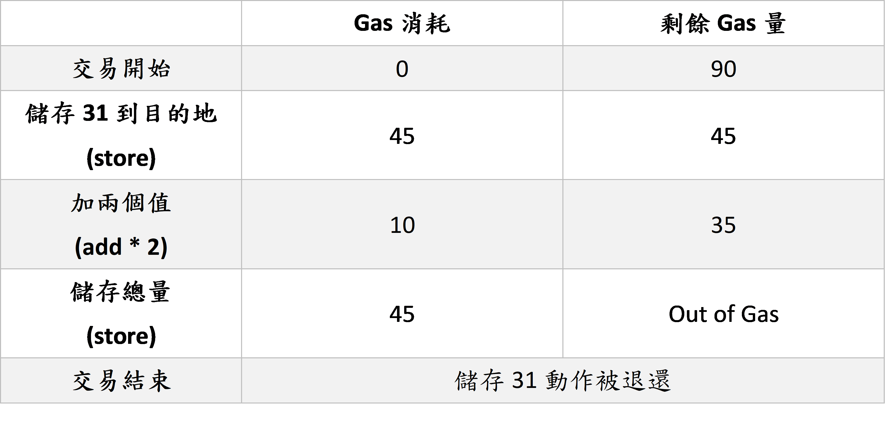

### **乙太坊及及其費用之間的關係**
　　Ethereum是一個分散式且真實存在世界各地的平台，它是個P2P網絡，也就表示它不需要管理員，也不會在節點之間產生錯誤，此應用程式從不停機，而且每個人都可以去創造一個屬於自己，且不用得到其他人同意的創新。從它被編碼之後，此應用程式就是真實且不變的，而且他們之間都是相互影響的。從這個觀點來看，對於智能合約從發想時就是它們最終的型態，此說法是合理的。

　　創造出這理念的核心是World Computer，就是將世界上的全部節點看成一個本體的世界電腦，這項技術被稱為Ethereum Virtual Machine(EVM)，這包含了資料的操作以及運算，而在這其中的每一筆交易都是一筆session(類似資料傳輸)，這是session互動的一個基礎，就像是一段句子是由文法或是單字組成。

***

### **甚麼是Gas呢？**
　　Gas指的是在全世界這個World Computer的是用量計量單位，打個比方，電力是用千瓦來計量，在Ethereum中更多的運算和儲存空間使用則是會增加Gas值，而用來支撐這些Gas消耗量的就是全世界的礦工(Miner)，他們的算量支撐了這個World Computer的Gas需求量，對此礦工們會收到fee，也就是俗稱的小費。

　　每個在EVM中的變更操作都會消耗Gas，舉個例子來說，乘法會消耗5Gas，加法則消耗3Gas，[Gas消耗量表](https://docs.google.com/spreadsheets/d/1m89CVujrQe5LAFJ8-YAUCcNK950dUzMQPMJBxRtGCqs/edit#gid=0)。

 ### **就把Gas當作是能源的一種吧！**

　　在每一筆交易中，都必須耗費必須的Gas量去支撐EVM所需的處理數據及儲存空間，有點像是RAM和ROM，而每一筆交易剩餘的Gas都會退回給予原本提供此筆交易提供的人，如果不夠的話這筆交易就會回復成初始狀態，依然存在此區塊當中，而若使區塊產生變化，其相關的費用也會給予礦工。
　　在看了以能源的方面看待Gas的觀點後，我們用小費的方式來看看吧！當每一次在EVM中運算所消耗的Gas量(例如乘法消耗5Gas)，每個交易者可以指定一個特定的Gas量，現在每個Gas的價格是2*10^ -8 ETH，則對於礦工來講小費的算法就是，(初始Gas – 剩餘Gas) * Gas單價。

　　以下是Fuel(能源)和Fee(小費)的觀點不同的表格對照：
 　　
　　假如一筆交易的能源過少，它甚至不會到達任何礦工的手上，假如一筆交易有充足的能源，但是給予的fee(小費)太低，儘管到達礦工那邊，也不會有任何的運算產生，費用也會決定交易的優先順序，高能源可能會導致交易的延遲性，這會在這篇文章的高啟動能源的潛在延遲性(Potential delays with high startGas)提及。

***
### **啟動能源(startGas)**
　　這個章節主要會說到交易開始所需要的能源，在交易的計算和儲存之前，World Computer網絡必須去計算它所需的Gas量，具體來說，在交易之前礦工必須要知道他會得到的小費是多少，這所需的啟動能源必須要能支撐他所會消耗的能源，而startGas也是每一筆交易所必要且重要的。
* startGas是[ETH白皮書](https://github.com/ethereum/wiki/wiki/White-Paper)內的術語
* gasLimit是[ETH黃皮書](https://github.com/ethereum/yellowpaper)內的術語
* gas則是在[Geth](https://github.com/ethereum/go-ethereum/releases)或是[web3.js](https://github.com/ethereum/web3.js/releases)內部的用法

　　startGat讓交易變的比較方便，不然當需要Gas時較要有一筆request回到交易所有人再要求Gas的消耗請求，也能讓礦工知道這筆交易所需的算力，而礦工的機器是否足夠能在有限的時間內跑完這次的交易計算，對於使用ETH應用的使用者來講，如何去提供startGas看起來可能沒那麼容易，但還是有工具可以去估算startGas的。
***
### **Gas不足的例外拋出(Out of Gas exception)**
　　一筆交易內會包含了發起人能夠提供的最大能源消耗，而Gas會在EVM的計算中持續消耗，假如在交易完成前用盡Gas，則會有Out of Gas的例外拋出，原本給予礦工的那些費用和給予的紀錄都會寫在區塊鍊當中，但是其他的變動都會被回復(像是contract的建立、數值的儲存、log)。
  
　　下面是一次交易的例子，用startGas為90為例：

　　在交易開始時，發起者必須設定其發起資金(startGas × gasPrice)，並叫由第三方託管，而此筆交易在第三方託管的ETH量是：90*0.02μETH=1.8μETH
